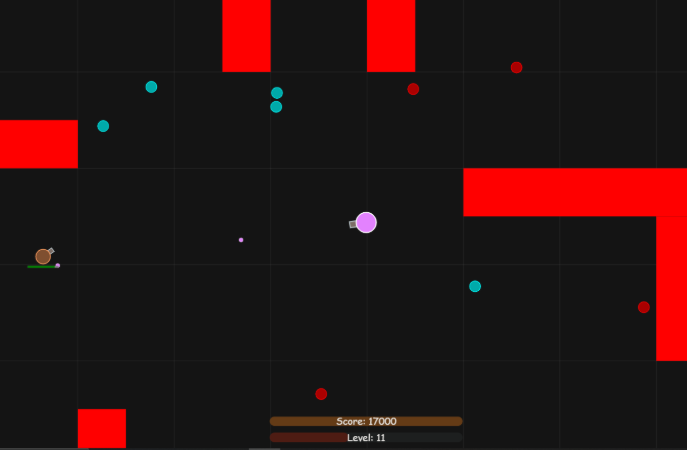
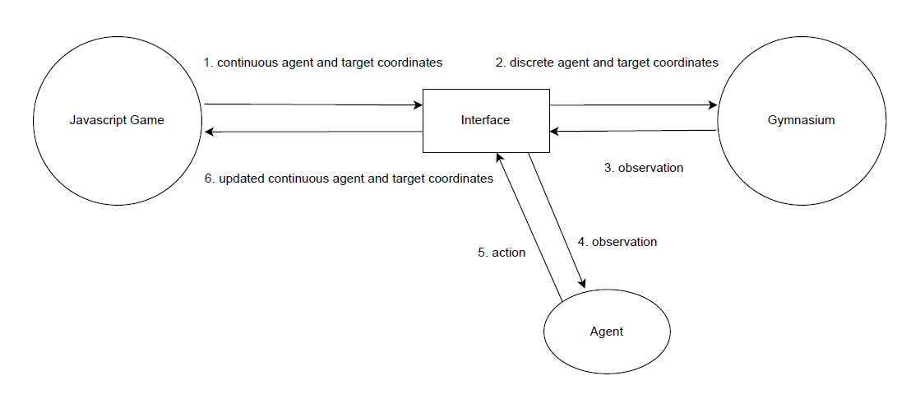

# Maze Navigation using Reinforcement Learning 🧭🤖

This repository contains the source code for a **thesis project** on training an agent to navigate mazes using **Reinforcement Learning (RL)**.  

It leverages the **[Gymnasium](https://gymnasium.farama.org/)** library to implement a standard maze navigation environment and explores the **generalization capabilities of RL agents** in increasingly complex scenarios.  

---

## 📌 Project Overview  

- **Core Algorithm:** Proximal Policy Optimization (PPO) via [Stable-Baselines3](https://stable-baselines3.readthedocs.io/).  
- **Framework:** Python + Gymnasium for RL logic & environments.  
- **Integration:** A trained Python agent is successfully integrated with a **JavaScript multiplayer game** (Tankio engine).  
- **Objective:**
  - Evaluate the **generalization capabilities** of RL agents for maze navigation.    
  - Demonstrate integration of a gymnasium-trained RL agent with an **interactive JavaScript multiplayer game (Tankio)**.  

---

## 🛠️ Technical Stack  

- **Core RL & Env:** Python, Gymnasium, Stable-Baselines3  
- **Deep Learning Backend:** PyTorch  
- **Game Engine:** Node.js + WebSockets (Tankio)  
- **Visualization & Training Logs:** TensorBoard  

---

## 🚀 Getting Started  

### 🔧 Prerequisites  

- **Python 3.x**  
- **pip** (Python package installer)  
- **Node.js** (for game integration)  

---

### 🐍 Python Environment Setup  

```bash
# Clone repository
git clone https://github.com/VasileiosKokki/MazeNavigationRL_Thesis.git
cd MazeNavigationRL_Thesis

# Create and activate virtual environment
python -m venv venv

# Windows
venv\Scripts\activate

# macOS/Linux
source venv/bin/activate

# Install dependencies
pip install -r requirements.txt

# (macOS users: use requirements_mac.txt if issues occur)
```

---

### 🎯 Running RL Experiments  

The main script: `python/agent.py`  

#### Available Modes:
- `--train` → Train a new model  
- `--test` → Test agent behavior  
- `--testEval` → Record visited cells during testing

#### Example Commands:  

```bash
# Training (experiment7)
python python/agent.py --folder experiment7 --train

# Testing
python python/agent.py --folder experiment7 --test

# Launch TensorBoard
tensorboard --logdir logs
```


---

## 🎮 Tankio: Javascript Multiplayer Game

**Tankio** is a lightweight, real-time multiplayer game built with **Node.js**.  
It provides the **interactive environment** for testing the RL agent.  

### 🔧 Setup Instructions  

```bash
# Navigate to repo
cd MazeNavigationRL_Thesis

# Install dependencies
npm install
```

### 🖥️ Running the Game  

```bash
# Start the Server Hub
node serverhub/serverhub.js

# Start the Game Server (default port 3001)
node server/server.js

# Example with custom port
node server/server.js --port 3002
```

📍 Open your **browser** → connect to the Hub (`localhost:3000`) → join a game.  



---

## 🔗 Python ↔ JavaScript Integration  

The **integration layer** is handled via `interface.py`.  
It acts as a **bridge** between the **continuous 2D JavaScript game space** and the **discrete Gymnasium grid world**.  

### 🔄 Data Flow  

1. The game provides the continuous coordinates of both the **agent** and the **target**.
2. The **interface file** converts the coordinates into **discrete values** (cell coordinates) based on the cells that the agent and the target belong to, and updates the **Gymnasium environment** with these.
3. The **Gymnasium environment** returns an **observation** to the interface, which includes the discrete positions of the agent and the target.
4. The **interface file** sends the observation it just received to the **pre-trained model**.
5. The **pre-trained model** selects an **action** based on the observation and sends it back to the interface file.
6. The **interface file** applies the selected action, calculates the **new continuous positions** of the agent and t[he target, and updates the **JavaScript game** with these new coordinates.



---

## ✅ Integration Verification  

- Deterministic reproducibility test with `seed=42`.  
- **Standalone Python vs Integrated Game+Python** → identical paths across 100 episodes.  

The process for verification was as follows:

Standalone Execution: The Gymnasium environment was run autonomously in Python for 100 episodes with eval mode and folder experiment2. A fixed random seed ( seed = 42 ) was used to ensure deterministic starting positions and behavior. The sequence of grid cells visited by the agent in each episode was logged to a file.

Integrated Execution: The full integrated system (JavaScript game + Python interface) was run, also with seed = 42 , for 100 episodes with eval mode and folder experiment2. The visited cells were logged in the same manner.

Comparison: The two log files were compared by running compare_visited_cells.py . The comparison showed no discrepancies, confirming that the integration layer was transparent and did not introduce any side effects. The agent's behavior remained identical and reproducible.

### 📊 Results

| Episode | Visited Cells |
|---------|---------------|
| 1       | 61, 51, 52, 53, 54, 44, 45 |
| 2       | 74, 73, 72, 62, 61, 51 |
| 3       | 12, 13, 23, 33, 43, 53, 63, 64, 74 |
| 4       | 66, 65, 55, 45, 35, 25, 24, 14 |
| 5       | 46, 45, 44, 34 |
| …       | … |
| 100     | 73, 63, 53, 43, 44 |

---

✨ This project demonstrates the **generalization of RL agents to increasingly complex maze environments** and its shortcomings, while also showcasing the **seamless deployment of trained agents** in **interactive, real-world applications**.
