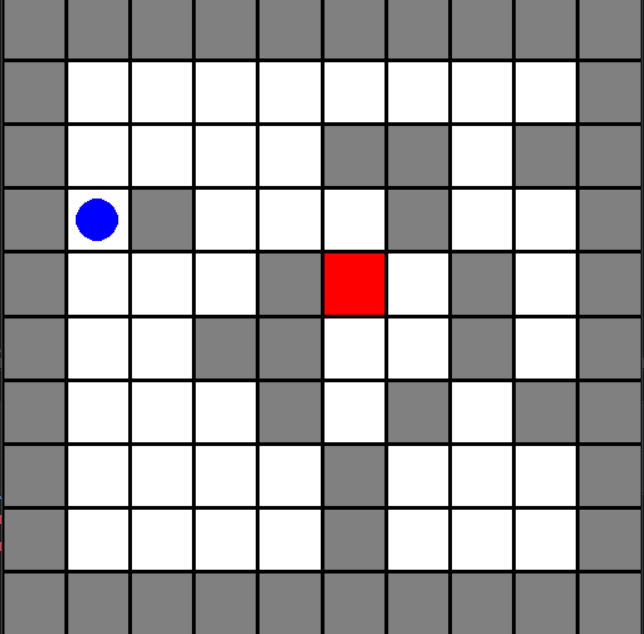

# Maze Navigation using Reinforcement Learning 🧭🤖

This repository contains the source code for a **thesis project** on training an agent to navigate mazes using **Reinforcement Learning (RL)**.  

It leverages the **[Gymnasium](https://gymnasium.farama.org/)** library to implement a standard maze navigation environment and explores the **generalization capabilities of RL agents** in increasingly complex scenarios.  

---

## 📌 Project Overview  

- **Core Algorithm:** Proximal Policy Optimization (PPO) via [Stable-Baselines3](https://stable-baselines3.readthedocs.io/).  
- **Framework:** Python + Gymnasium for RL logic & environments.  
- **Integration:** A trained Python agent is successfully integrated with a **JavaScript multiplayer game** (Tankio engine).  
- **Objective:**
  - Evaluate the **generalization capabilities** of RL agents for maze navigation.

---

## 🛠️ Technical Stack  

- **Core RL & Env:** Python, Gymnasium, Stable-Baselines3  
- **Deep Learning Backend:** PyTorch
- **Visualization & Training Logs:** TensorBoard  

---

## 🚀 Getting Started  

### 🔧 Prerequisites  

- **Python 3.x**  
- **pip** (Python package installer)

---

### 🐍 Python Environment Setup  

```bash
# Clone repository
git clone https://github.com/VasileiosKokki/MazeNavigationRL_Thesis.git
cd MazeNavigationRL_Thesis

# Create and activate virtual environment
python -m venv venv

# Windows
venv\Scripts\activate

# macOS/Linux
source venv/bin/activate

# Install dependencies
pip install -r requirements.txt

# (macOS users: use requirements_mac.txt if issues occur)
```

---

### 🎯 Running RL Experiments  

The main script: `python/agent.py`  

#### Available Modes:
- `--train` → Train a new model  
- `--test` → Test agent behavior  
- `--testEval` → Record visited cells during testing

#### Example Commands:  

```bash
# Training (experiment7)
python python/agent.py --folder experiment7 --train

# Testing
python python/agent.py --folder experiment7 --test

# Launch TensorBoard
tensorboard --logdir logs
```



---

✨ This project demonstrates the **generalization of RL agents to increasingly complex maze environments** and its shortcomings.
