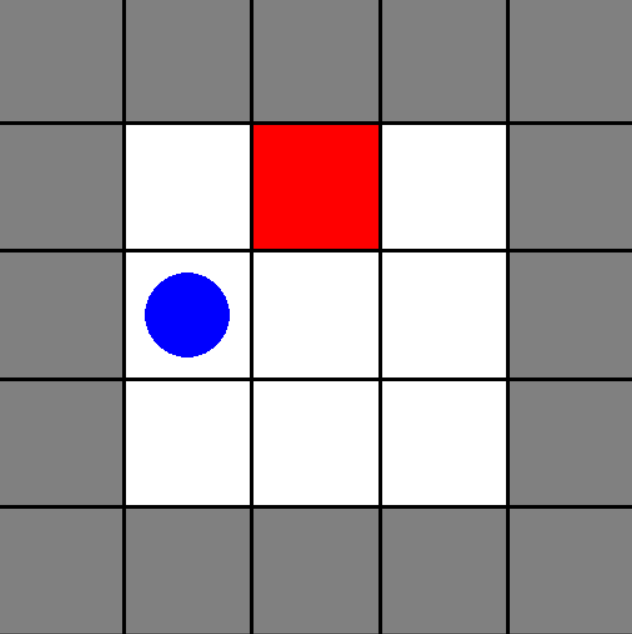
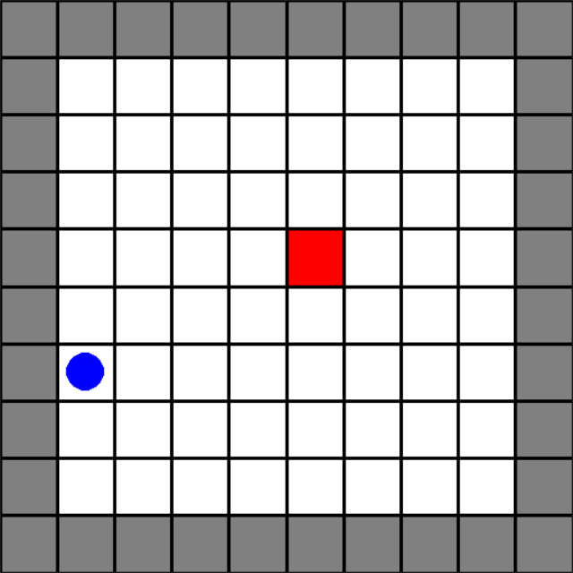
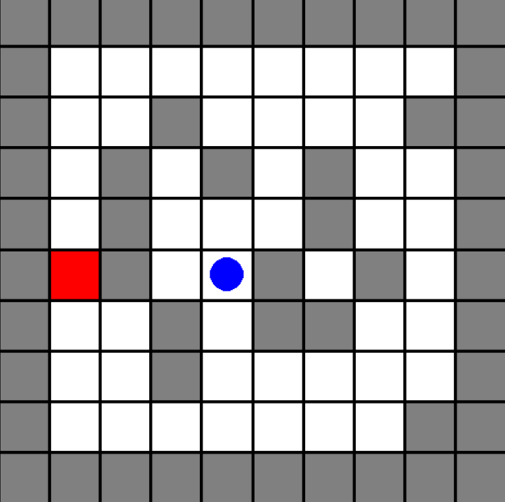
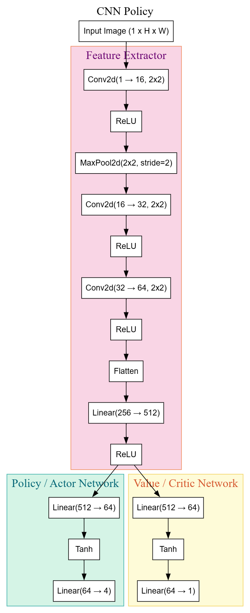

# Reinforcement Learning for Maze Navigation and Real-Time Game Integration

> **Individual Bachelor Thesis Project · Harokopio University of Athens · 2025**  
> **Author:** Vasileios Kokkinogenis

This project investigates a practical reinforcement-learning question:

> **How well can a PPO agent generalize as navigation environments become larger, more spatially complex, and less predictable — and can a policy trained in a discrete Gymnasium environment be transferred into a continuous real-time JavaScript game?**

The repository combines two connected pieces of work:

1. **A custom reinforcement-learning research environment and controlled experiment suite** for studying PPO generalization in maze-like navigation tasks.
2. **A Python ↔ JavaScript integration layer** that deploys a trained policy inside a server-authoritative multiplayer browser game.

The work was developed as my Bachelor thesis, **“Evaluation of Reinforcement Learning Agent Generalization in Navigation Environments and Connection with a Game Environment.”**

**Thesis:** https://estia.hua.gr/entities/publication/9664ba80-bbcb-473f-838e-2f2d910ccb31

---

## Visual Overview

<p align="center">
  
  
</p>

<p align="center">
  <em>Left: custom Gymnasium navigation environment. Right: the real-time JavaScript game used for agent integration.</em>
</p>


### Demo Video

https://github.com/user-attachments/assets/6fc789c4-2d30-4795-900b-aa729d20049f

<p align="center">
  <em>The recording shows the real-time JavaScript game and the synchronized Gymnasium-side representation used by the RL interface.</em>
</p>

---

## Project Context and Goal

Reinforcement-learning agents can achieve strong average performance while still failing badly in uncommon states. I wanted to study that problem in a controlled navigation setting rather than evaluate a single trained model on a single maze.

I therefore designed the project around **progressively harder experiments**, changing one major factor at a time while keeping the remaining configuration as stable as possible. The study examined:

- environment scale;
- presence and variability of obstacles;
- **MLP vs CNN** observation processing;
- **sparse vs dense rewards**;
- **frame stacking** for temporal context;
- fixed/cycling layouts vs fully random obstacle layouts.

A second goal was deployment-oriented: after training in Gymnasium, I wanted to test whether a trained policy could drive an agent in an interactive game whose world uses **continuous pixel coordinates**, real-time updates, WebSockets, and browser rendering rather than a discrete RL grid.

This made the project both a research exercise in **RL generalization** and a systems-engineering exercise in **integrating learned behavior into interactive software**.

---

## My Role and Contributions

This was an **individual thesis project**. I was responsible for the research design, programming, experimentation, evaluation, integration, and documentation.

### 1. Custom Gymnasium navigation environment

I implemented a configurable environment rather than relying on a fixed benchmark. It supports:

- configurable square grid sizes;
- four discrete actions: right, up, left, down;
- no obstacles, predefined obstacle patterns, or new random layouts;
- vector observations for MLP policies;
- image-like observations for CNN policies;
- sparse or dense reward configurations;
- deterministic seeding;
- Pygame rendering;
- a maximum episode horizon of 100 steps.

For dense feedback, progress is measured differently depending on the geometry:

- **Manhattan distance** when no internal obstacles exist;
- **A\* path-based distance** when obstacles are present.

This allowed the reward signal to reflect whether an action actually improved the navigable route to the target rather than only its straight-line displacement.

### 2. PPO training and configurable experiment pipeline

I trained agents with **Proximal Policy Optimization (PPO)** using Stable-Baselines3 and PyTorch.

The training pipeline includes:

- experiment-specific environment configurations;
- experiment-specific model configurations;
- vectorized training with 8 environments;
- automatic continuation from the latest checkpoint;
- custom CNN feature extraction;
- optional 4-frame stacking;
- seeded execution;
- TensorBoard logging.

The repository keeps each experiment under `configs/experimentX/`, making changes in architecture and environment design explicit and reproducible.

### 3. Evaluation beyond average reward

One of the most important lessons from the project was that **average performance can hide edge cases**.

To investigate this, I implemented custom callbacks and evaluation logic for:

- mean episode reward;
- goal-success rate;
- mean episode length;
- **maximum episode length**;
- **maximum number of wrong steps**.

The last two metrics were particularly useful: some agents had acceptable average behavior while occasionally entering long, repetitive failure trajectories. Those cases revealed generalization weaknesses that would have been easy to miss by looking only at mean reward.

### 4. Controlled eight-experiment study

I designed a sequence of experiments in which complexity was increased progressively and major changes were isolated as much as possible.

| Experiment | Environment / change | Policy | Reward | Frame stack |
|---|---|---|---|---|
| **1** | 5×5, no internal obstacles | MLP | Sparse | No |
| **2** | 10×10, no internal obstacles | MLP | Sparse | No |
| **3** | 10×10, 15 obstacles, one layout | MLP | Sparse | No |
| **4** | 10×10, 15 obstacles, 10 cycling layouts | MLP | Sparse | No |
| **5** | Same complex environment; MLP → CNN | CNN | Sparse | No |
| **6** | Same CNN setup; sparse → dense reward | CNN | Dense | No |
| **7** | Same setup; add temporal context | CNN | Dense | **4 frames** |
| **8** | New random obstacle layout every episode | CNN | Dense | **4 frames** |

### Visual progression of environment complexity

<p align="center">
  
  
  
  
</p>

<p align="center">
  <em>From a small obstacle-free grid to larger spaces and changing obstacle geometry. The experiment sequence increased difficulty progressively instead of jumping directly to the hardest setting.</em>
</p>

This structure let me study not only whether performance changed, but **why a specific design change was likely responsible**.

### 5. Python ↔ JavaScript agent integration

I designed `python/interface.py` as an adapter between two incompatible representations:

- the game uses **continuous 2D coordinates**;
- the trained policy expects a **discrete grid observation**.

The integration loop:

1. receives game entities and continuous coordinates from Node.js;
2. maps agent and target positions to grid cells;
3. updates a custom Gymnasium runtime environment;
4. produces the observation expected by the trained PPO model;
5. performs deterministic inference;
6. maps the discrete action back to a direction in continuous game space;
7. updates the game entity coordinates;
8. returns the updated state to Node.js.

The Node.js game server launches Python as a child process and communicates using **newline-delimited JSON over stdin/stdout**.

This was one of the main technical challenges of the project because the goal was not simply to call a Python model from JavaScript. The two systems had different coordinate systems, update semantics, and environment responsibilities, so I had to define an explicit interface between them.

### 6. Real-time multiplayer game system

The integrated runtime is a browser game built with:

- Node.js;
- Express;
- WebSockets (`express-ws`);
- HTML Canvas 2D;
- Web Workers;
- a server hub and multiple game-server architecture.

The game follows a **server-authoritative / thin-client approach**: the server owns critical world state and gameplay logic, while clients send input and render the received state.

The repository includes mechanics and systems such as:

- real-time player movement;
- projectiles and combat;
- collisions and knockback;
- health and regeneration;
- score and level progression;
- death and respawning;
- AI-controlled agents;
- camera tracking and zoom;
- spatial partitioning for collision processing;
- compressed state updates to clients;
- server discovery through the hub.

The RL agent is therefore deployed into an actual interactive loop rather than demonstrated only in an isolated notebook or offline simulation.

---

## Research Methodology

The experiment design followed a **one-major-factor-at-a-time progression**.

The sequence began with a small obstacle-free environment, increased the search space, introduced geometry and layout variability, then tested whether representation, feedback density, temporal context, and randomization improved behavior.

This progression was important because simply comparing unrelated configurations would make it difficult to understand which change caused an improvement.

### Metrics

I evaluated both normal and worst-case behavior using:

- mean reward;
- success rate;
- mean episode length;
- maximum episode length;
- maximum wrong steps.

### Aggregate thesis results

The following values summarize the eight experiments reported in the thesis:

| Experiment | Mean reward | Success rate | Mean length | Max length | Max wrong steps |
|---|---:|---:|---:|---:|---:|
| **1** | 0.98 | 0.99 | 2.02 | 4.07 | 1.99 |
| **2** | 0.94 | 0.99 | 5.33 | 14.35 | 2.27 |
| **3** | 0.73 | 0.81 | 6.70 | 53.53 | 21.39 |
| **4** | 0.57 | 0.61 | 5.94 | 100.00 | 50.97 |
| **5** | 0.71 | 0.78 | 8.57 | 100.00 | 50.70 |
| **6** | 0.79 | 0.82 | 7.28 | 100.00 | 50.60 |
| **7** | 0.91 | 0.91 | 6.83 | 100.00 | 49.94 |
| **8** | 0.83 | 0.82 | 7.53 | 77.36 | 36.82 |

### Main findings

**Spatial representation mattered.** In the same complex 10×10 setting with cycling obstacle layouts, switching from MLP to CNN increased success from **0.61 to 0.78** and mean reward from **0.57 to 0.71**.

**Denser feedback helped.** Adding dense rewards to the CNN setup improved success from **0.78 to 0.82** and mean reward from **0.71 to 0.79**, while also improving learning speed.

**Temporal context produced the largest later-stage gain.** Adding 4-frame stacking raised success from **0.82 to 0.91** and mean reward from **0.79 to 0.91**.

**Randomization improved exposure to varied layouts but did not eliminate difficult cases.** With a fresh random obstacle configuration per episode, the agent still achieved **0.82 success**, but performance dropped relative to the 10-pattern setup. At the same time, worst-case aggregate values improved compared with Experiment 7, illustrating the trade-off between predictability, average performance, and broader state coverage.

The central conclusion was that strong average performance is not the same as robust generalization. Even when mean metrics stabilized, maximum episode duration and wrong-step behavior exposed rare states in which the policy could still fail or repeat ineffective actions.

---

## Key Challenges and How I Approached Them

### Challenge 1 — Increasing complexity broke apparently successful policies

A PPO agent that worked extremely well in a small empty grid degraded when obstacles and changing layouts were introduced.

**Approach:** I increased complexity gradually instead of jumping directly to the hardest environment. This made the point of failure visible and gave me a basis for testing targeted changes such as CNN observations, reward shaping, and frame stacking.

**What I learned:** a model can solve a benchmark-like setup without learning a strategy that transfers to more varied geometry.

### Challenge 2 — Average metrics hid serious edge cases

Some configurations showed reasonable average reward while occasionally producing very long episodes and repeated wrong actions.

**Approach:** I added custom worst-case metrics — maximum episode length and maximum wrong steps — alongside standard averages.

**What I learned:** evaluation design is part of model design. For interactive agents, rare failures can matter more than a small gain in average reward.

### Challenge 3 — The observation representation had to match the problem

A flat MLP input could encode the state, but it did not exploit the local spatial structure of a maze.

**Approach:** I introduced image-like grid observations and a custom CNN feature extractor, then compared the architectures in the same complex environment.

**What I learned:** representation choice can be more important than simply training longer or tuning a single hyperparameter.

### Challenge 4 — Sparse rewards gave limited learning signal

In complex layouts, receiving meaningful feedback mainly at the end of an episode made progress harder to learn.

**Approach:** I added dense progress feedback using Manhattan distance in empty grids and A\*-based path progress when obstacles were present.

**What I learned:** reward shaping can accelerate learning, but it must reflect the actual navigable geometry of the environment.

### Challenge 5 — A trained grid policy could not directly control a continuous game

The Gymnasium model acts in discrete cells; the game runs in continuous pixel coordinates and updates in real time.

**Approach:** I built an interface layer that performs continuous ↔ discrete coordinate conversion, observation synchronization, model inference, and action-to-motion translation.

**What I learned:** deploying AI into an interactive system requires explicit contracts between the model and runtime. The integration layer can be as important as the model itself.

### Challenge 6 — I needed evidence that the bridge was behaviorally transparent

A visually plausible agent was not enough; coordinate conversion or timing logic could silently alter its trajectory.

**Approach:** I ran both:

- the standalone Python/Gymnasium execution; and
- the integrated JavaScript + Python execution

for **100 episodes with `seed=42`**, logged every visited cell, and compared the traces.

**Result:** no discrepancies were found between the two executions.

**What I learned:** cross-language integration should be validated with deterministic tests, not only visual inspection.

---

## Selected Policy Architecture

<p align="center">
  
</p>

<p align="center">
  <em>Thesis diagram of the CNN feature extractor and actor–critic heads used for image-like maze observations.</em>
</p>

---

## Technical Complexity and Creative Aspects

The project goes beyond training an off-the-shelf RL model in several ways:

- a **custom parameterized Gymnasium environment** supports multiple observation and reward modes;
- a controlled **eight-experiment progression** investigates generalization under increasing complexity;
- dense rewards use **A\* route progress** when obstacle geometry makes Manhattan distance insufficient;
- a custom CNN extractor and **4-frame temporal stacking** explore spatial and temporal representations;
- custom callbacks expose **worst-case behavior**, not only mean performance;
- a dedicated runtime environment separates training semantics from live-game state synchronization;
- a **Node.js child-process bridge** streams JSON between JavaScript and Python;
- a discrete policy is adapted to a **continuous, real-time multiplayer world**;
- deterministic trace comparison verifies that the bridge does not change agent behavior.

The creative focus of the project was the connection between **research evaluation** and **interactive deployment**: I wanted not only to study where an RL agent generalizes or fails, but also to understand what is required to make that agent act inside a live software system.

---

## Relevance to GRACE, XR, Gamification and Interactive Media

This is not an XR application by itself, but the engineering problems are directly relevant to intelligent interactive systems:

- **AI agents in interactive worlds:** a learned policy perceives state and acts inside a live game loop;
- **simulation-to-runtime transfer:** behavior trained in one environment is adapted to another representation and execution model;
- **spatial reasoning:** the research focuses on navigation, obstacle geometry, coordinate systems, and temporal context;
- **real-time interaction:** the game uses continuous updates, WebSockets, browser rendering, and multiplayer state synchronization;
- **gamification and game systems:** the runtime includes combat, progression, scoring, respawning, and AI-controlled entities;
- **evaluation of user-facing AI behavior:** worst-case trajectories matter because failures become visible in an interactive experience.

For future XR work, I see the same class of challenge appearing when an agent trained in simulation must interact with a real-time 3D environment: observations, coordinate systems, action semantics, timing, and evaluation all need to be aligned carefully.

---

## System Architecture

### Training path

```text
Experiment config
      │
      ▼
Custom GridWorldEnv ──► Vector / image observation
      │
      ▼
8 vectorized environments
      │
      ▼
PPO (Stable-Baselines3)
      │
      ├──► checkpoints
      ├──► TensorBoard logs
      └──► custom evaluation metrics
```

### Live integration path

```text
Browser Client
    │  input / rendered state
    ▼
Node.js Game Server
    │  JSON drawables via stdin
    ▼
Python interface.py
    │  continuous coords → grid cells
    ▼
Custom RealWorld Gymnasium Env
    │  observation
    ▼
Pre-trained PPO Model
    │  discrete action
    ▼
Python interface.py
    │  action → continuous movement
    ▼
Node.js Game Server
    │  authoritative state update
    ▼
Browser Client
```

> **Current integration configuration:** `python/interface.py` loads the latest model from `models/experiment2`.

---

## Technology Stack

| Area | Technologies |
|---|---|
| Reinforcement learning | PPO, Stable-Baselines3 |
| Deep learning | PyTorch |
| Environment design | Gymnasium, NumPy, Pygame |
| Training / evaluation | Vectorized environments, TensorBoard, custom SB3 callbacks |
| Game backend | Node.js, Express, WebSockets |
| Browser rendering | HTML Canvas 2D, JavaScript, Web Workers |
| Cross-language integration | Python child process, stdin/stdout, JSON Lines |
| Path reasoning | Manhattan distance, A\* |

---

## Repository Structure

```text
MazeNavigationRL_Thesis/
├── assets/                     # README / thesis visuals
├── configs/
│   ├── experiment1/            # Environment + PPO config
│   ├── ...
│   └── experiment8/
├── evaluations/                # Visited-cell traces for verification
├── logs/                       # TensorBoard logs
├── models/                     # Trained PPO checkpoints
├── public/
│   ├── client/                 # Browser game client
│   ├── clienthub/              # Server selection UI
│   └── worker/                 # Off-main-thread rendering logic
├── python/
│   ├── agent.py                # PPO training, testing, evaluation
│   ├── callbacks.py            # Custom evaluation callbacks
│   ├── compare_visited_cells.py
│   ├── interface.py            # Python ↔ JavaScript bridge
│   ├── utils.py
│   └── gym_world/              # Installable custom Gymnasium package
├── server/                     # Authoritative game server
├── serverhub/                  # Server discovery / selection hub
├── obstacle_patterns.json
├── requirements.txt
└── package.json
```

---

## Getting Started

### Prerequisites

- Python 3.10+ recommended
- `pip`
- Node.js LTS for the JavaScript game

### Install Node.js LTS on Windows

```powershell
winget install OpenJS.NodeJS.LTS
```

After installation, open a new terminal and verify:

```powershell
node --version
npm --version
```

---

## Python Setup

Clone the repository and enter it:

```bash
git clone https://github.com/VasileiosKokki/MazeNavigationRL_Thesis.git
cd MazeNavigationRL_Thesis
```

### Windows

```powershell
python -m venv .venv
.venv\Scripts\Activate.ps1
python -m pip install --upgrade pip
pip install -r requirements.txt
```

### macOS / Linux

```bash
python3 -m venv .venv
source .venv/bin/activate
python -m pip install --upgrade pip
pip install -r requirements.txt
```

> macOS users can use `requirements_mac.txt` when appropriate for their platform setup.

### Install the custom Gymnasium environment

This step is required so the registered environments
`gymnasium_env/GridWorld-v0` and `gymnasium_env/RealWorld-v0` can be imported by the training and integration scripts.

From the repository root:

```bash
pip install -e ./python/gym_world
```

---

## Run the RL Experiments

The main entry point is:

```text
python/agent.py
```

### Train

```bash
python python/agent.py --folder experiment7 --train
```

Training runs in repeated 10,000-timestep blocks and keeps saving the latest checkpoint until interrupted.

### Test a trained model

```bash
python python/agent.py --folder experiment7 --test
```

### Record visited cells for deterministic evaluation

```bash
python python/agent.py --folder experiment2 --testEval
```

### Launch TensorBoard

```bash
tensorboard --logdir logs
```

Then open the URL printed by TensorBoard.

---

## Run the JavaScript Game and RL Integration

Install Node.js dependencies:

```bash
npm install
```

The game server automatically starts `python/interface.py`, so the Node.js process must be able to find the same Python environment in which the RL dependencies and custom Gymnasium package were installed.

### Optional: explicitly configure the Python executable

First find the active interpreter:

```bash
python -c "import sys; print(sys.executable)"
```

Then set `PYTHON_EXECUTABLE` to that path.

**PowerShell example:**

```powershell
$env:PYTHON_EXECUTABLE = "C:\path\to\your\python.exe"
```

**Windows CMD example:**

```cmd
set PYTHON_EXECUTABLE=C:\path\to\your\python.exe
```

If `PYTHON_EXECUTABLE` is not set, the server falls back to `python` on Windows and `python3` on other platforms.

### 1. Start the server hub

```bash
node serverhub/serverhub.js
```

The hub runs at:

```text
http://localhost:3000
```

### 2. Start a game server

In a second terminal:

```bash
node server/server.js
```

The default game-server port is `3001`.

Start another server on a custom port:

```bash
node server/server.js --port 3002
```

Run a server in evaluation mode:

```bash
node server/server.js --eval
```

### 3. Open the hub

Open:

```text
http://localhost:3000
```

Choose an online game server from the hub.

---

## Integration Verification

I validated the Python ↔ JavaScript bridge with a deterministic trajectory comparison.

### Standalone run

- Gymnasium environment executed directly in Python;
- Experiment 2 model;
- deterministic model inference;
- `seed=42`;
- 100 episodes;
- every visited cell recorded.

### Integrated run

- JavaScript game server;
- Python interface layer;
- same Experiment 2 model;
- same seed and 100-episode procedure;
- every visited cell recorded again.

### Compare the traces

```bash
python python/compare_visited_cells.py
```

The comparison found **no discrepancies**, providing evidence that the integration layer preserved the policy trajectory under the controlled test conditions.

---

## What I Learned

The project changed how I think about both AI experiments and interactive systems.

- A high average score can conceal rare but severe failures.
- Environment design and evaluation metrics strongly influence what conclusions can be drawn from an RL experiment.
- Spatial problems benefit from representations that preserve spatial structure.
- Temporal information can materially change navigation performance.
- Randomization can improve exposure to diverse states, but robustness still needs explicit evaluation.
- Moving a model from a training environment into an interactive runtime is a systems problem involving coordinate conversion, state synchronization, timing, process communication, and verification.
- For AI in games, XR, or other interactive media, the model is only one part of the final experience.

---

## Limitations and Future Research

The thesis also identified limitations under increased uncertainty rather than presenting PPO as a fully solved approach:

- in environments with fully random obstacle placement, the average metrics remained satisfactory, but variation in the maximum episode duration revealed scenarios in which the agent still struggled;
- these difficult cases indicated limitations in fully covering the state space and signs of overfitting toward average states;
- more broadly, the experiments highlighted that classical techniques can remain effective while still showing limits when evaluated under conditions of increased uncertainty, keeping generalization as an open challenge.

The future direction stated in the thesis is therefore deliberately broad: **further research into more robust and generalizable architectures**.

The JavaScript-game integration additionally demonstrated the feasibility of embedding trained agents into a live interactive environment.

---

## Thesis and Citation

**Bachelor Thesis**  
*Evaluation of Reinforcement Learning Agent Generalization in Navigation Environments and Connection with a Game Environment*  
Vasileios Kokkinogenis · Harokopio University of Athens · 2025

Thesis record:
https://estia.hua.gr/entities/publication/9664ba80-bbcb-473f-838e-2f2d910ccb31

A `CITATION.cff` file is included in this repository for software citation metadata.

---

## License

This repository is released under the terms provided in [`LICENSE`](LICENSE).
